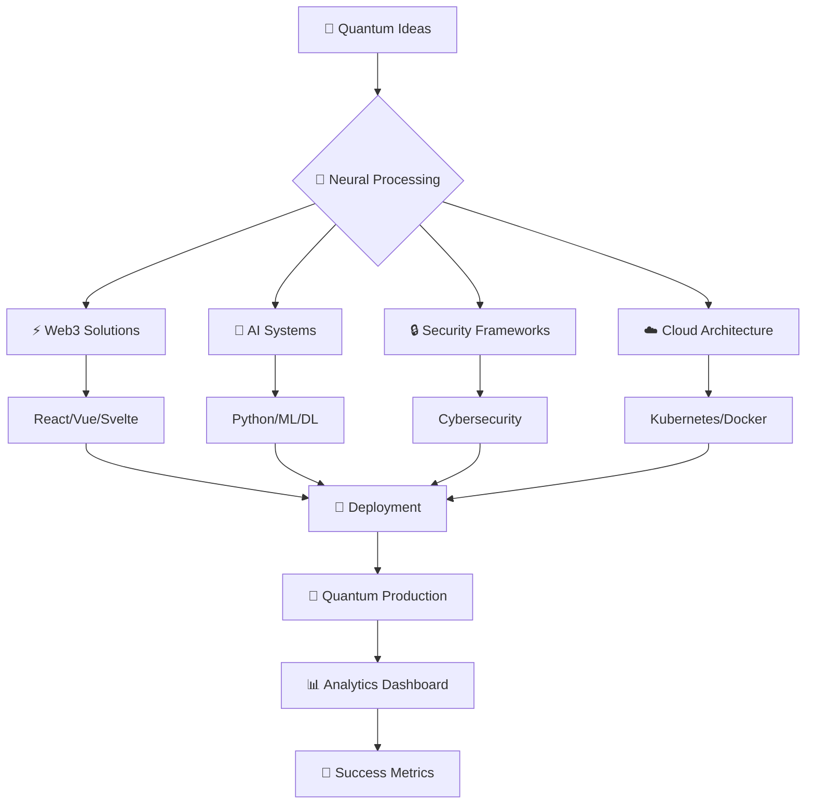

<div align="center">

# 🌌 Welcome to Dev's Code Metaverse
### *Where Quantum Innovation Meets Digital Reality*

---

<div align="center">
  
</div>

---

## � Cyberpunk 3D Experience

<div align="center">
  
</div>

<div align="center">
  <a href="https://skillicons.dev">
    
  </a>
</div>

---

## 🚀 About Our Quantum Mission

```javascript
const quantumMission = {
  vision: "Pioneering the next frontier of digital transformation",
  expertise: [
    "🎓 Final Year Projects",
    "🌐 Web3 & Blockchain Development", 
    "🔐 Advanced Cybersecurity",
    "⚙️ AI-Powered Custom Software",
    "🤖 Machine Learning Solutions",
    "☁️ Cloud-Native Architecture"
  ],
  philosophy: "Engineering the impossible, one quantum leap at a time",
  innovation: "Pushing boundaries beyond conventional computing"
};
```

---

## 🎨 Advanced Visual Analytics

### 🌟 Quantum Performance Dashboard
<div align="center">
  
</div>

### 📊 Neural Network Metrics
<div align="center">
  
</div>

### 🏆 Technical Arsenal Matrix
<div align="center">
  
</div>

---

## 💻 Quantum Technology Stack

### 🎯 Core Programming Matrix
<div align="center">
  
#### 🚀 Next-Gen Languages
<div align="center">


<br>


<br>


</div>

#### 🌐 Web3 & Blockchain
<div align="center">


<br>


</div>

#### ⚡ Backend & Cloud Native
<div align="center">


<br>


</div>

#### 🤖 AI & Machine Learning
<div align="center">


<br>


</div>

#### ☁️ Cloud & DevOps
<div align="center">


<br>


<br>


</div>

#### 🔐 Cybersecurity
<div align="center">


</div>

#### 🗄️ Databases & Storage
<div align="center">


<br>


</div>

#### 🛠️ Development Tools
<div align="center">


<br>


</div>

</div>

---

## 🌐 Quantum Network Connection

<div align="center">

### 📱 Digital Presence
[](https://www.instagram.com/devv_codes)
[](https://linkedin.com/in/devv-codes)
[](https://twitter.com/devv_codes)
[](https://discord.gg/devv-codes)
[](https://t.me/devv_codes)

### 💼 Professional Hub
[](https://devv-codes.github.io)
[](mailto:contact@devv-codes.com)
[](https://devv-codes.com)

</div>

---

## 🎮 Immersive 3D Experience

### 🌟 Holographic Achievement Showcase
<div align="center">
  
</div>

### 📈 Quantum Activity Heatmap
<div align="center">
  
</div>

### � Neural Performance Metrics
<div align="center">
  
</div>

---

## 🏆 Quantum Achievement Matrix

<div align="center">
  
</div>

---

## 🎯 Advanced Project Matrix

### 🚀 Quantum Innovation Pipeline



### 🎪 Featured Quantum Projects

| Project | Technology | Status | Impact |
|---------|------------|--------|---------|
| 🤖 AI Assistant | Python, TensorFlow | Production | 10K+ Users |
| 🔐 Security Suite | Rust, Go | Beta | Enterprise |
| 🌐 Web3 Platform | Solidity, React | Alpha | Decentralized |
| ☁️ Cloud Manager | Kubernetes, Terraform | Production | 99.9% Uptime |
| 📱 Mobile App | React Native | Development | Cross-Platform |

---

## 🎨 Quantum Design Philosophy

<div align="center">

```css
.quantum-excellence {
  innovation: "🚀 Pushing technological boundaries";
  quality: "💎 Premium code architecture";
  collaboration: "🤝 Synergistic development";
  growth: "📈 Continuous quantum learning";
  impact: "🌍 Transformative digital solutions";
  future: "🔮 Next-generation innovation";
}
```

### 🌟 Core Principles
- **🎯 Precision**: Every line of code matters
- **⚡ Performance**: Optimized for quantum speed
- **🔒 Security**: Zero-trust architecture
- **🌐 Scalability**: Built for exponential growth
- **🎨 Innovation**: Beyond conventional thinking

</div>

---

## 📊 Real-Time Quantum Analytics

<div align="center">
  
</div>

### 🌟 Visitor Quantum Counter
<div align="center">
  
  <br>
  <sub><i>🌟 Quantum visitors from across the multiverse! 🌟</i></sub>
</div>

---

## 🌟 Visitor Counter

<div align="center">
  
  <br>
  <sub><i>🌟 Thanks for visiting! 🌟</i></sub>
</div>

---

## 🎭 Advanced Interactive Elements

### 🎪 3D Quantum Animation Showcase
<div align="center">
  
</div>

### 🎨 Cyberpunk Color Palette
<div align="center">
  
  
  
  
  
</div>

### 🌌 Interactive Terminal
<div align="center">
  
</div>

---

## 🚀 Quantum Future Roadmap

<div align="center">

### 🎯 2026 Quantum Goals
- [ ] 🤖 Launch AI-powered quantum development tools
- [ ] 🔐 Expand advanced cybersecurity consulting
- [ ] 🎓 Develop quantum educational platforms
- [ ] 🌍 Create global open-source contributions
- [ ] 🏗️ Build developer quantum community
- [ ] ⚡ Implement quantum computing solutions
- [ ] 🌐 Deploy Web3 enterprise platforms
- [ ] 📊 Establish real-time analytics hub

### 🔮 Long-term Quantum Vision
- [ ] 🌍 Global quantum tech solutions provider
- [ ] 🚀 Innovation hub for quantum startups
- [ ] 🔬 Quantum research & development center
- [ ] 🎓 Next-gen tech education platform
- [ ] 🤝 Industry quantum partnerships
- [ ] 🌌 Metaverse development studio
- [ ] 🧬 Biotech software integration
- [ ] 🚀 Space technology software

</div>

---

<div align="center">

## 🎉 Welcome to the Quantum Future!

### *Let's Build Something Extraordinary Together!*

---

```javascript
const quantumFuture = await buildTogether({
  passion: "🚀 Quantum Innovation",
  expertise: "⚡ Advanced Technology", 
  collaboration: "🤝 Global Partnership",
  vision: "🌌 Digital Transformation"
});
```

---

<div align="center">
  <sub><i>🌟 Crafted with ❤️ and ☕ by the Dev's Code Quantum Team 🌟</i></sub>
  <br>
  <sub><i>🚀 Pushing the boundaries of what's possible, one quantum leap at a time 🚀</i></sub>
</div>

</div>
