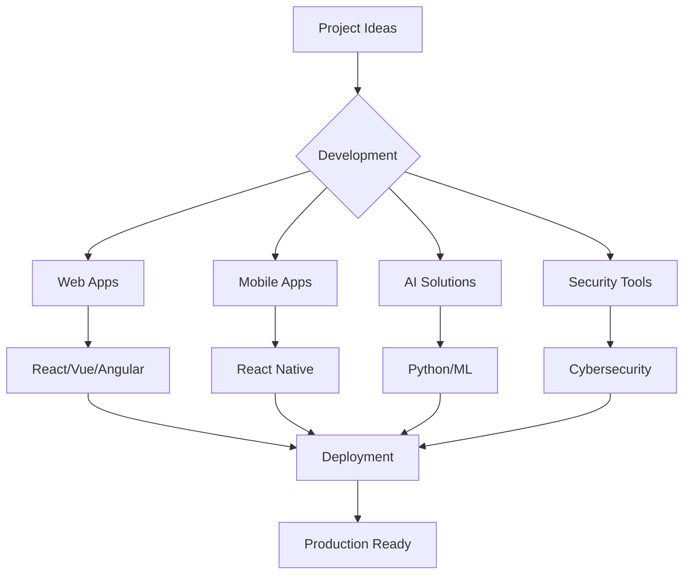

<div align="center">

# 🌌 Welcome to Dev's Code Universe
### *Where Innovation Meets Implementation*

---

<div align="center">
  
</div>

---

## 🎭 3D Interactive Experience

<div align="center">
  <a href="https://skillicons.dev">
    
  </a>
</div>

---

## 🚀 About Our Mission

```javascript
const mission = {
  vision: "Empowering students & startups with cutting-edge technology",
  expertise: [
    "Final Year Projects",
    "Web Development", 
    "Cybersecurity",
    "Custom Software Solutions"
  ],
  philosophy: "Turning complex ideas into elegant, working systems"
};
```

---

## 🎨 Visual Journey

### 🌟 Company Overview
<div align="center">
  
</div>

### 📊 Performance Metrics
<div align="center">
  
</div>

### 🏆 Technical Arsenal
<div align="center">
  
</div>

---

## 💻 Technology Stack

### 🎯 Core Technologies
<div align="center">
  
#### Programming Languages


#### Web Technologies


#### Backend & Databases


#### Cloud & DevOps


#### AI & Machine Learning


#### Tools & Technologies


</div>

---

## 🌐 Connect With Us

<div align="center">

### 📱 Social Media
[](https://instagram.com/devv_codes)
[](https://linkedin.com/in/devv-codes)
[](https://twitter.com/devv_codes)

### 💼 Professional
[](https://devv-codes.github.io)
[](mailto:contact@devv-codes.com)

</div>

---

## 🎮 Interactive Features

### 🌟 3D Tech Stack Visualization
<div align="center">
  
</div>

### 📈 Activity Heatmap
<div align="center">
  
</div>

---

## 🏆 Achievements

<div align="center">
  
</div>

---

## 🎯 Project Showcase

### 🚀 Featured Projects



---

## 🎨 Design Philosophy

<div align="center">

```css
.excellence {
  innovation: "Cutting-edge technology";
  quality: "Clean, efficient code";
  collaboration: "Team-driven development";
  growth: "Continuous learning";
  impact: "Real-world solutions";
}
```

</div>

---

## 📊 Real-time Analytics

<div align="center">
  
</div>

---

## 🌟 Visitor Counter

<div align="center">
  
  <br>
  <sub><i>🌟 Thanks for visiting! 🌟</i></sub>
</div>

---

## 🎭 Interactive Elements

### 🎪 3D Animation Showcase
<div align="center">
  
</div>

### 🎨 Color Palette
<div align="center">
  
  
  
  
</div>

---

## 🚀 Future Roadmap

<div align="center">

### 🎯 2024 Goals
- [ ] Launch AI-powered development tools
- [ ] Expand cybersecurity consulting
- [ ] Develop educational platforms
- [ ] Create open-source contributions
- [ ] Build developer community

### 🔮 Long-term Vision
- [ ] Global tech solutions provider
- [ ] Innovation hub for startups
- [ ] Research & development center
- [ ] Tech education platform
- [ ] Industry partnerships

</div>

---

<div align="center">

## 🎉 Thank You for Visiting!

### *Let's Build Something Amazing Together!*

---

```javascript
const future = await buildTogether({
  passion: "Innovation",
  expertise: "Technology", 
  collaboration: "Partnership"
});
```

---

<div align="center">
  <sub><i>Made with ❤️ and ☕ by Dev's Code Team</i></sub>
</div>

</div>
